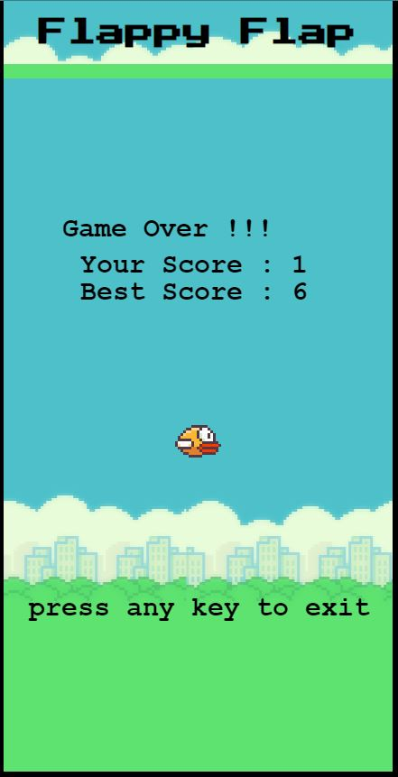

# JS-Flappy-Bird

Game Flappy Bird by lezardon

Projet proposé par le site fromScratch. :

Les composants (oiseaux, barres et fond) proviennent d'une seule image "flappy-bird-set.png" du dossier "media" dont on extrait la partie qui nous intéresse.

## Aménagements

Acceleration progressive du défilement

### `lezardon`

Open [https://laurent-lezardon.github.io/AudioPlayerByLezardon/](https://laurent-lezardon.github.io/AudioPlayerByLezardon/) to view it in your browser.
